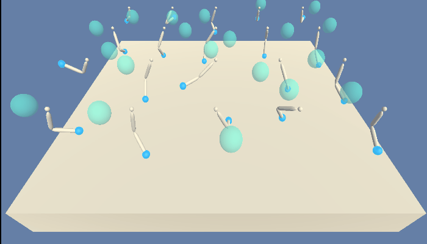
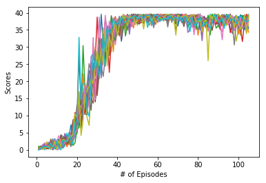
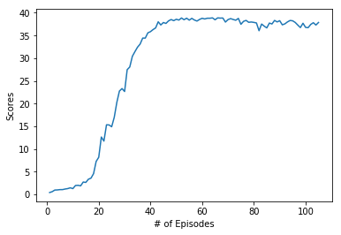

# Reacher-Environment-Continuous-Control-with-DDPG-algorithm
Implementation of the DDPG algorithm to solve Continuous Control Reacher Environment. This algorithm was introduced in the paper [Continuous control with deep reinforcement learning.](https://arxiv.org/abs/1509.02971)

20 Untrained agents

 

20 Trained agents


## Introduction

Set-up: Double-jointed arm which can move to target locations.

Goal: The agents must move its hand to the goal location, and keep it there.

Observation Space:
The observation space consists of 33 variables corresponding to position, rotation, velocity, and angular velocities of the arm.

Action Space:
Each action is a vector with four numbers, corresponding to torque applicable to two joints. Every entry in the action vector should be a number between -1 and 1.

Reward:
A reward of +0.1 is provided for each step that the agent's hand is in the goal location. 

Solving the Environment:
There are two versions on this environment. In this repository, I have solved the 20-agent version of the environment. The environment is considered solved when our agents get an average score of +30 over 100 consecutive episodes, and over all agents.

Distributed Learning:
All our 20-agents experience different observations and add them to the memory buffer. The algorithm then can sample memories from the experiences of all these agents. This is called distributed learning and it helps accelerate the training as opposed to just using one agent.From my own experience, when I tried to train the single agent environment, it took me more than 1000 episodes and I still didn't get a satisfactory score. But training using 20-agents, solved the environement in 105 episodes (with some tweaking of the hyperparameters and the network).

Plot of 20 agents and Mean score of 20 agents:





## Instructions:

- To train your own weights, run ``` python train.py```
- To evaluate my model, run ``` python evaluate.py```
- To explore the code, please open the Continuous_Control_Project.ipynb file.
- I have also uploaded the trained local actor and critic models.
- I have explained the algorithm in more detail in the report.pdf file along with the hyperparameters and plot of agents' scores.

Installation:

Udacity's Twenty (20) Agents Environment:
- Linux: [click here](https://s3-us-west-1.amazonaws.com/udacity-drlnd/P2/Reacher/Reacher_Linux.zip)
- Mac OSX: [click here](https://s3-us-west-1.amazonaws.com/udacity-drlnd/P2/Reacher/Reacher.app.zip)
- Windows (32-bit): [click here](https://s3-us-west-1.amazonaws.com/udacity-drlnd/P2/Reacher/Reacher_Windows_x86.zip)
- Windows (64-bit): [click here](https://s3-us-west-1.amazonaws.com/udacity-drlnd/P2/Reacher/Reacher_Windows_x86_64.zip)

(_For Windows users_) Check out [this link](https://support.microsoft.com/en-us/help/827218/how-to-determine-whether-a-computer-is-running-a-32-bit-version-or-64) if you need help with determining if your computer is running a 32-bit version or 64-bit version of the Windows operating system.

(_For AWS_) If you'd like to train the agent on AWS (and have not [enabled a virtual screen](https://github.com/Unity-Technologies/ml-agents/blob/master/docs/Training-on-Amazon-Web-Service.md)), then please use [this link](https://s3-us-west-1.amazonaws.com/udacity-drlnd/P1/Banana/Banana_Linux_NoVis.zip) to obtain the environment.

### Note:
If the jupyter notebook does not display for some reason, please copy the link to the notebook and use this website - https://nbviewer.jupyter.org/

